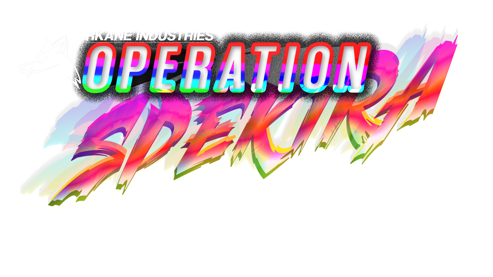

=============

ARKANE INDUSTRIES: OPERATION SPEKTRA
==========

ARKANE INDUSTRIES: OPERATION SPEKTRA is a powerful, easy-to-setup, and cost-effective machine learning model training platform. It is designed to accelerate and optimize training machine learning models anywhere and for a lot cheaper in parallel. The platform consists of two main components: an ML model trainer and a user-friendly web user interface.

ARKANE INDUSTRIES: OPERATION SPEKTRA ROADMAP
============================================

This is the roadmap for ARKANE INDUSTRIES' ambitious project: OPERATION SPEKTRA. Follow the progress of each task with the provided checkbox emojis.

📋 Roadmap
----------

*    ✅ TensorFlow training
*    ✅ Dataset cleaning
*    🔲 ggml4bit training
*    🔲 TensorFlow LoRa training
*    🔲 ggml4bit LoRa training
*    🔲 ggml 4bit training
*    🔲 DirectX 12 DirectML Framework

Legend
------

*   ✅: Completed task
*   🔲: In-progress or pending task

ARKANE INDUSTRIES: OPERATION SPEKTRA TOOL SUITE POLICY
=====================================================
## Transparency and Open Accessibility

All datasets, models, LoRas, and other ML applications using ARKANE INDUSTRIES: OPERATION SPEKTRA must collaborate and contribute to the collective knowledge base. This fosters a spirit of open accessibility and ensures the continuous improvement of AI models and applications. Users are encouraged to:

*   Share their research findings, methodologies, and best practices with the community.
*   Contribute improvements and innovations to ARKANE INDUSTRIES: OPERATION SPEKTRA, enabling other users to benefit from advancements.
*   Engage in open discussions and knowledge exchange to promote transparency and collaboration in AI development.

This approach not only benefits individual users but also enriches the entire ecosystem, driving progress and innovation in AI technologies......

# Please read the POLICY file for the full policy.
<a href="./POLICY.MD">READ ME FIRST</a>

Features
--------

*   ML model trainer for training and fine-tuning models
*   Responsive web user interface for managing training tasks
*   Docker-based for easy setup and deployment
*   Caching and data storage using Redis
*   Scalable to run multiple training tasks in parallel
*   Cost-effective for training models on various hardware configurations

Prerequisites
-------------

To get started with ARKANE INDUSTRIES: OPERATION SPEKTRA, you need to have the following installed:

*   Docker: [Download Docker](https://www.docker.com/get-started)
*   Docker Compose: [Download Docker Compose](https://docs.docker.com/compose/install/)

Quickstart Guide
----------------

1.  Clone the ARKANE INDUSTRIES: OPERATION SPEKTRA repository:

    bash

    `git clone https://github.com/yourusername/repo.git && cd repo`

2.  Build and start the Docker containers:

    `docker-compose up -d`

    This command will build and start the ML model trainer, web user interface, and Redis services.

3.  Access the web user interface:

    Open your browser and navigate to [http://localhost:3000](http://localhost:3000). You should see the ARKANE INDUSTRIES: OPERATION SPEKTRA web user interface, where you can manage and monitor your training tasks.

4.  To stop and remove the Docker containers, run:

    `docker-compose down`

Usage
-----

*   Upload your dataset and configure your model training settings using the web user interface.
*   Monitor the progress of your training tasks in real-time.
*   Download your trained models and apply them to your machine learning projects.
*
Training Parameters
===============================

found in:
 `./config/config.json`
 
#### Below is an explanation of each parameter in the given JSON configuration:

*   `huggingface_access_token`: The access token for authentication with Hugging Face's services (e.g., Hugging Face Hub, Model Hub, etc.).

*   `model`: The identifier of the pre-trained model to be used for fine-tuning, in this case, it is "bigscience/bloom-560M".

*   `model_tokenizer`: The identifier of the tokenizer to be used with the model, in this case, it is the same as the model: "bigscience/bloom-560M".

*   `data`: The path to the training dataset file in JSON format, here "datasets/quicktrain/Alp\_vic\_unfiltered.json".

*   `eval_data`: The path to the evaluation dataset file in JSON format, here "datasets/quicktrain/vic\_eval\_DAT.json".

*   `out_dir`: The output directory where the trained model and associated files will be saved, in this case, "ELIAI\_MODELS".

*   `MICRO_BATCH_SIZE`: The number of examples in a micro-batch, used for model training. A value of 0 means the batch size will be automatically determined.

*   `GRADIENT_ACCUMULATION_STEPS`: The number of gradient accumulation steps, used to aggregate gradients from multiple micro-batches before performing a weight update.

*   `EPOCHS`: The number of epochs (complete passes through the dataset) to train the model.

*   `LEARNING_RATE`: The learning rate to be used for model training, here 3e-5.

*   `CUTOFF_LEN`: The maximum sequence length for input examples, in this case, 400 tokens.

*   `MAX_STEP`: The maximum number of training steps to be performed. A value of 0 means the number of steps will be determined by the number of epochs.

*   `CPU_MODE`: A boolean flag to indicate whether to train the model using only CPU resources (true) or using GPU resources if available (false).

*   `PreProcessedData?`: A boolean flag to indicate whether the input data is pre-processed (true) or not (false).

*   `Load_Checkpoint`: A boolean flag to indicate whether to load a previously saved checkpoint for model training (true) or to start training from the pre-trained model (false).

Extra parameters
----------------

*   `eval_steps`: The number of training steps between evaluation runs.

*   `load_best_model_at_end`: A boolean flag to indicate whether to load the best model at the end of training (true) or not (false).

*   `save_steps`: The number of training steps between saving checkpoints.

Contributing
------------

We welcome contributions to ARKANE INDUSTRIES: OPERATION SPEKTRA! If you'd like to contribute, please follow these steps:

1.  Fork the repository
2.  Create a new branch (`git checkout -b your-feature-branch`)
3.  Commit your changes (`git commit -m 'Add some feature'`)
4.  Push to the branch (`git push origin your-feature-branch`)
5.  Create a new pull request

License
-------

ARKANE INDUSTRIES: OPERATION SPEKTRA is released under the [MIT License](LICENSE).

Support
-------

If you encounter any issues or have any questions, please open an issue on the GitHub repository or contact the maintainers.

thanks to these repos for inspiration and code patterns:
<a href="https://github.com/tloen/alpaca-lora">alpaca LoRa</a>
<a href="https://github.com/oobabooga/text-generation-webui">oobabooga's text-generation-webui</a>

